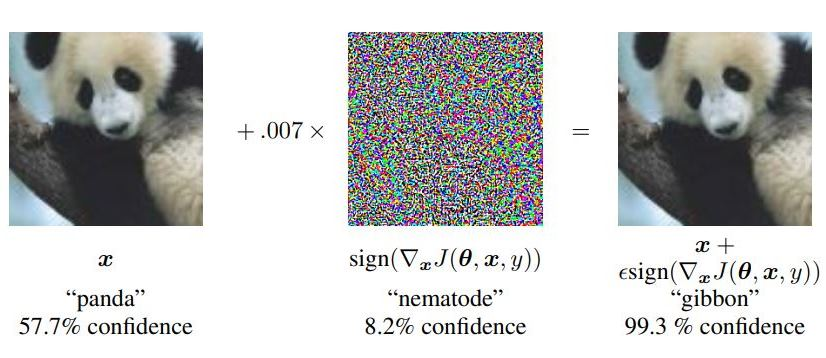

# Adar: Adversarial Activity Recognition in Wearables
This is the accompanying blog post for my paper "Adar: Adversarial Activity Recognition in Wearables", which was
accepted in the 2018 International Conference on Computer Aided Design (ICCAD). In this blog post I will highlight the objective
and motivation for this project and discuss the important results from the experiments. But before we dive in into the
technicalities of the paper, let's first understand the problem at hand.

Human activity recognition (HAR) is a major research area in the field of mobile and ubiquitous computing. In the
recent years we have seen a rise in the adoption of wearables devices that are used to monitor different health markers
such as activity level, diet intake, medicine adherence, etc. Almost all of these devices use one or more machine
learning algorithms to measure these bio-markers and provide information to the user. However, recent studies have found
that machine learning systems which perform very well on inference and prediction tasks are often very vulnerable to
adversarial perturbations. In particular even the addition of a small amount of carefully computed perturbations to the
clean samples degrade the performance of machine learning systems significantly. For example consider the image below,
which is taken from "*Explaining and Harnessing Adversarial Examples*" by **Goodfellow and et. al**. This image shows
that not only the addition of adversarial perturbation to the clean sample is able to fool the classifier but also that
the classifier is more confident in it's incorrect prediction.

This result have caused a significant increase in the research work concerning adversarial examples. But mostly these
works are from Computer Vision and Natural Language Processing and there was a gap in research on whether or not
and how activity recognition algorithms may become the subject of adversarial attacks. Human activity recognition shares
many aspects that are common to other areas of Computer Science but it also has its own unique set of challenges and
requires dedicated set of computational methods. For example, the data used to make the inference often comes from a
collection of heterogeneous sensors with different characteristics unlike fixed and well-defined sensing modules such as
as cameras and microphones. Furthermore, unlike other areas where the problem is well defined (e.g., "Is this an image
of a dog?", or "Is the word Harry present in this sentence?"), HAR algorithms need to deal with new challenges due to 
1. complexity of human movements captured from individual body joints and observed partially with wearable sensors
2. lack of concrete definitions, languages, or structure of human activities.
For starter, human activity is highly complex and diverse and the sensor readings for an activity can be very different
even if the activity is performed by the same person under similar conditions compared to, for example, image
classification where an image of a dog is always a dog independent on the presentation and context. Hence, in this paper
we studied the consequences of adversarial examples for activity recognition models and propose an optimization driven
framework called "*Adar*" for generating adversarial examples in wearables systems. The major contributions we made in
this paper are:
1. introduced *Adar* framework for adversarial examples computation for human activity recognition systems,
2. investigated gradient based optimization methods for generating adversarial examples in the context of HAR systems, 
3. compared the robustness of a HAR system towards adversarial examples in feature and signal domain, 
4. evaluated Deep Neural Network (DNN) models trained for HAR on adversarial examples after adversarial training.

