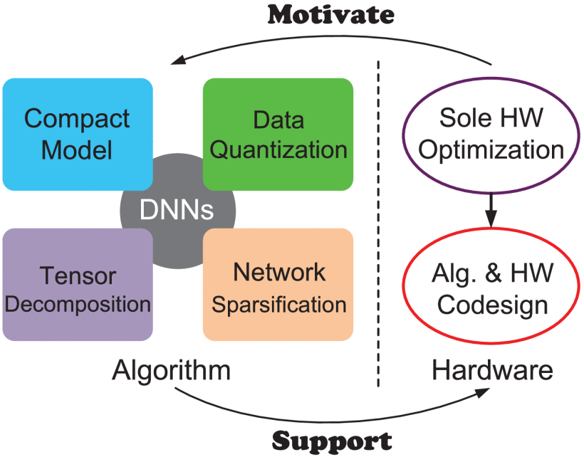

Are you deploying machine learning models on embedded platforms or mobile devices?

Here are the common optimization techniques to decrease your model footprint and improve performance (latency, power consumption, memory requirement).

1. Compact Model: From the start design smaller models that can still achieve acceptable performance on the task at hand. This involves a thoughtful design process and choosing the components of the model based on the downstream (embedded or mobile) performance requirements.

2. Tensor Decomposition: Simplify large tensors or matrices into smaller matrices or tensors to shrink the memory volume and operation cycle of the model. Clustering of model's parameters is one way to achieve this. Clustering groups the weights of each layer into a predefined number of clusters and then provide the centroid of each cluster for computation.

3. Data quantization: Decrease the precision of the model's parameters. This is one of the most famous and easier ways to optimize machine learning models for deployment in edge devices.

4. Network Sparsification: reduce the number of connections/neurons of the network to get a smaller good enough model. Pruning can be used to sparsify a network. Pruning removes parameters within a model that have only a minor impact on its performance. The important part of pruning is choosing which parameters to drop. One easy heuristic is to drop parameters whose value is close to zero.

These techniques can be combined to greatly optimize a machine learning model and make it suitable for deployment on edge devices. But it is easier said than done. Optimization usually results in a decrease in the model's performance and the loss in performance varies for different models. In rare cases, optimization can rather result in the improvement of the model performance. So, it is up to the system designers to choose which optimization techniques to use and how much they are willing to sacrifice on the model's performance.

A great read on this is [Model Compression and Hardware Acceleration for Neural Networks: A Comprehensive survey](https://ieeexplore.ieee.org/document/9043731).